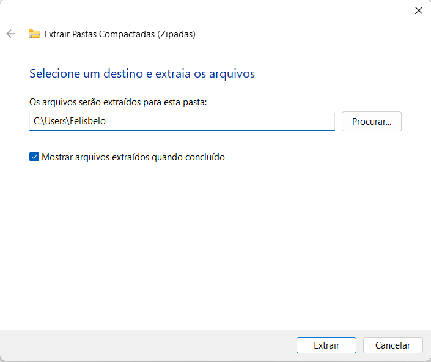
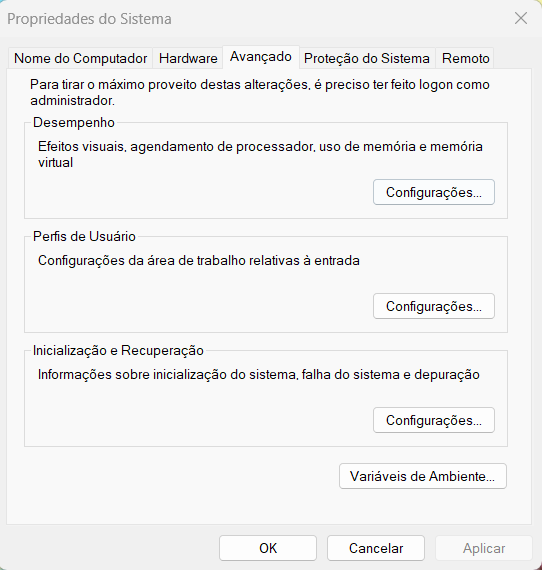
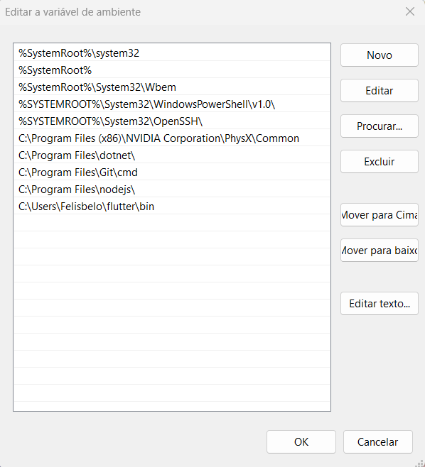
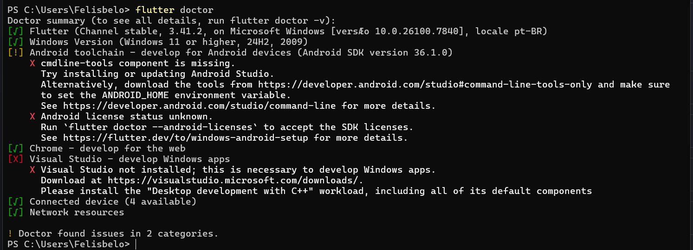

# Manual de instalação e Configuração do Flutter
## **Passos**
- **[Baixar Flutter]()**
- **[Exportar Arquivo.zip]()**
- **[Editar Variáveis de Ambiente]()**
- **[Testar]()**

---
## **Baixar Flutter**
- [Clique aqui](https://docs.flutter.dev/install/manual) para baixar o Flutter manualmente
    - Ao entrar na pagina oficial do Flutter
        - Selecione a marca da máquina(Windows, macOS, Linux ou ChromeOS)
        - Baixe o ``arquivo.zip`` encontrado em ***Install and set up Flutter*** que está mais abaixo na página

---
## **Exportar Arquivo.zip**
- Ao instalar o ``arquivo.zip`` siga os passos abaixo:
    1. Abra o **Explorador de Arquivos** depois vá nesses endereços:
        - **Nesse Computador**
        - **OS (C:)**
        - **Usuários** ou **Users**
        - **Seu usuário** (Exemplo: Felisbelo)

        Ou pule para o passo 3 e no endereço que estiver lá apague o que está depois do seu nome de usuário ``/Downloads/...``
    2. Clique nesse endereço e o copie:
       
        O endereço q aparecerá deverá ser algo como ``C:\Users\Seu usuário``
    3. Depois de copiar o endereço(CTRL + C)
        - Vá onde você baixou o ``arquivo.zip``(provavelmente em Downloads)
        - Clique com o botão direito no ``arquivo.zip`` e selecione a opção ***Extrair tudo***
        - Ao clicar em ***Extrir tudo*** cole o endereço que você copiou no campo mostrado abaixo:
        
            - Clique em **Extrair**

---
## **Editar Variáveis de Ambiente**
- Abra o **Explorador de Arquivos** depois vá nesses endereços:
    - **Nesse Computador**
    - **OS (C:)**
    - **Usuários** ou **Users**
    - **Seu usuário** (Exemplo: Felisbelo)
    - **flutter**
    - **bin**
- Copie esse endereço que ficará algo como ``C:\Users\Seu usuário\flutter\bin``
---
- Na barra de pesquisa da Máquina pesquise **"Editar as variáveis de ambiente do sistema"**
- Abra e clique em **"Variáveis de Ambiente..."** que fica no lado inferior direito
    
- Nas ***Variáveis do sistema*** selecione **"Path"** e **Editar...**
    
- Clique em **Novo**
  
- Cole o endereço ``C:\Users\Seu usuário\flutter\bin`` que você copiou

---
## **Testar**
 - Reiniciar a máquina
 - Abrir o Power Shell
    - No Power Shell digite o comando ``flutter doctor``
    - Resultado deve ser parecido com a tela abaixo
    
